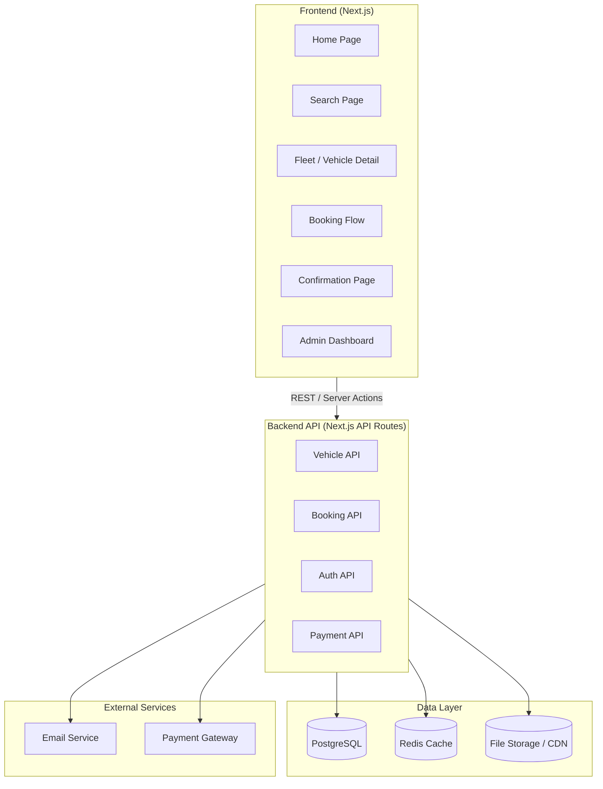
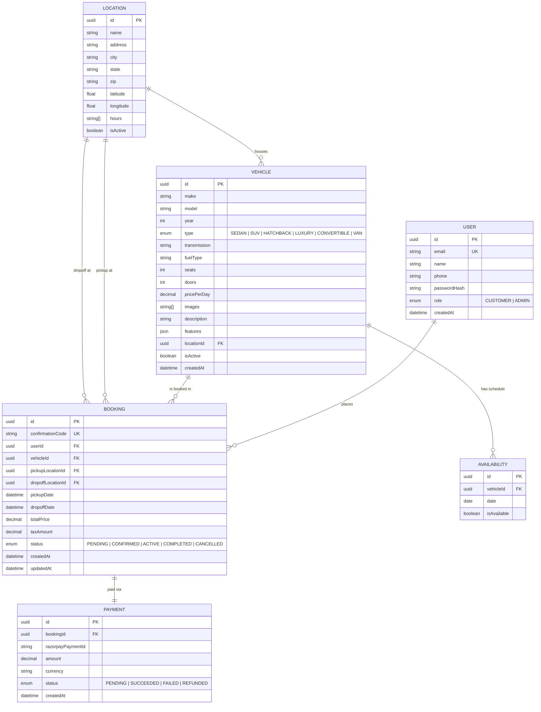
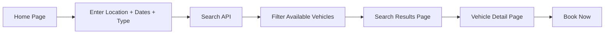
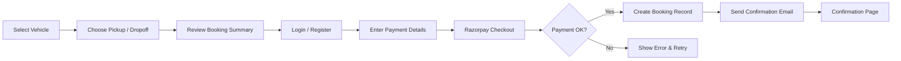
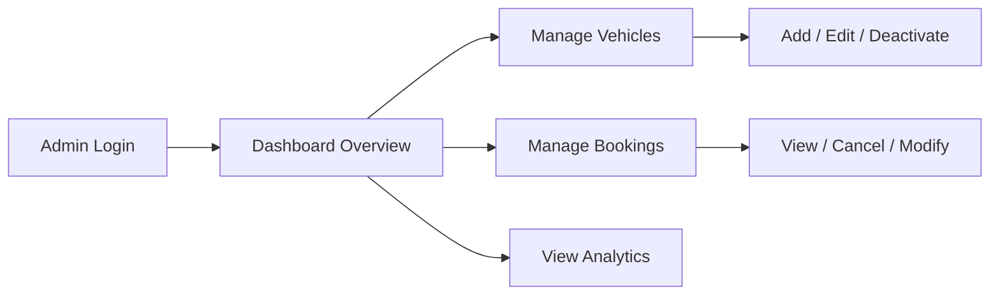
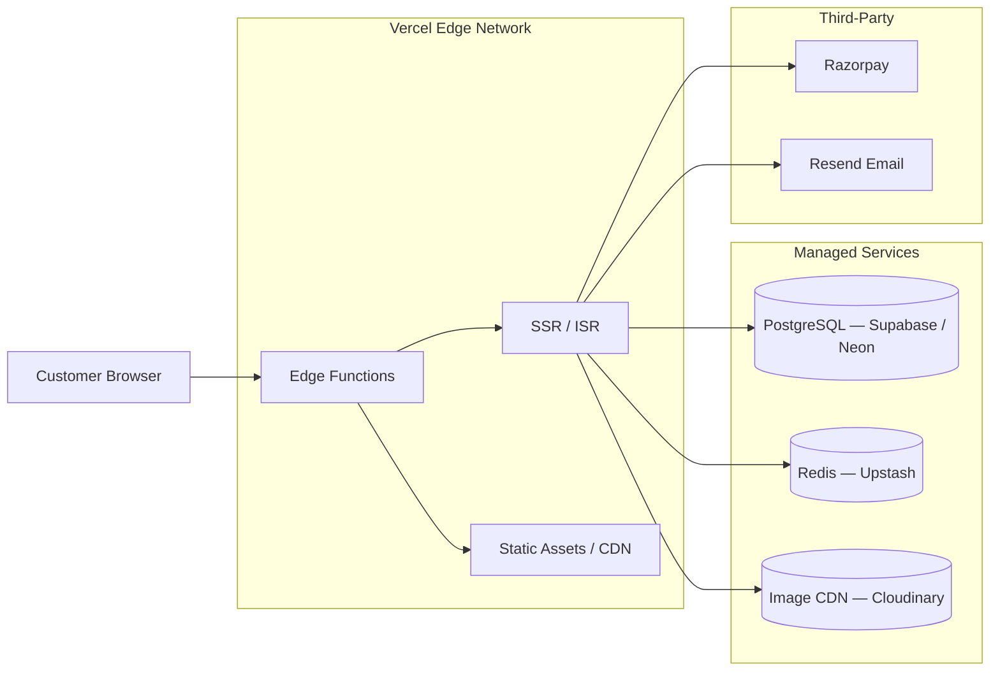

# Architecture — Way2Car Car Rental Booking Platform

> Derived from [context.md](file:///Users/iamprince/Desktop/ay2car1/docs/context.md)

---

## 1. Overview

Way2Car is a full-stack car rental booking website that provides a branded digital storefront for a car rental business. It enables customers to search vehicles by location, date, and type; browse the fleet with specs and pricing; and complete an end-to-end booking — all through a professional web experience that replaces phone calls, walk-ins, and generic third-party platforms.

---

## 2. High-Level Architecture



---

## 3. Tech Stack

| Layer | Technology | Rationale |
|---|---|---|
| **Framework** | Next.js 14+ (App Router) | SSR/SSG for SEO, API routes, server components |
| **Language** | TypeScript | Type safety across full stack |
| **Styling** | Vanilla CSS (custom design system) | Full brand control, no framework lock-in |
| **Database** | PostgreSQL | Relational data (vehicles, bookings, users) |
| **ORM** | Prisma | Type-safe queries, migrations, schema management |
| **Caching** | Redis | Availability lookups, session management |
| **Auth** | NextAuth.js | OAuth + credentials, session management |
| **Payments** | Razorpay | PCI-compliant checkout, refunds, UPI support |
| **Email** | Resend / Nodemailer | Booking confirmations, reminders |
| **File Storage** | Cloudinary / S3 | Vehicle images, fleet media |
| **Deployment** | Vercel | Zero-config Next.js hosting, edge functions |

---

## 4. Project Structure

```
ay2car1/
├── docs/                          # Documentation
│   ├── problemStatement.txt
│   ├── context.md
│   └── architecture.md
├── public/                        # Static assets
│   ├── images/
│   ├── icons/
│   └── fonts/
├── src/
│   ├── app/                       # Next.js App Router
│   │   ├── layout.tsx             # Root layout
│   │   ├── page.tsx               # Home page
│   │   ├── search/
│   │   │   └── page.tsx           # Vehicle search & results
│   │   ├── fleet/
│   │   │   ├── page.tsx           # Fleet listing
│   │   │   └── [vehicleId]/
│   │   │       └── page.tsx       # Vehicle detail
│   │   ├── booking/
│   │   │   ├── page.tsx           # Booking form
│   │   │   └── confirmation/
│   │   │       └── page.tsx       # Booking confirmation
│   │   ├── admin/
│   │   │   ├── page.tsx           # Admin dashboard
│   │   │   ├── vehicles/
│   │   │   │   └── page.tsx       # Vehicle management
│   │   │   └── bookings/
│   │   │       └── page.tsx       # Booking management
│   │   └── api/
│   │       ├── vehicles/
│   │       │   └── route.ts       # Vehicle CRUD + search
│   │       ├── bookings/
│   │       │   └── route.ts       # Booking CRUD

│   │       ├── auth/
│   │       │   └── [...nextauth]/
│   │       │       └── route.ts   # Auth endpoints
│   │       └── payments/
│   │           └── route.ts       # Payment processing
│   ├── components/
│   │   ├── ui/                    # Design system primitives
│   │   │   ├── Button.tsx
│   │   │   ├── Card.tsx
│   │   │   ├── Input.tsx
│   │   │   ├── Modal.tsx
│   │   │   └── Badge.tsx
│   │   ├── layout/                # Layout components
│   │   │   ├── Header.tsx
│   │   │   ├── Footer.tsx
│   │   │   ├── Navbar.tsx
│   │   │   └── Sidebar.tsx
│   │   ├── search/                # Search feature components
│   │   │   ├── SearchBar.tsx
│   │   │   ├── FilterPanel.tsx
│   │   │   ├── SearchResults.tsx
│   │   │   └── DateRangePicker.tsx
│   │   ├── fleet/                 # Fleet feature components
│   │   │   ├── VehicleCard.tsx
│   │   │   ├── VehicleGallery.tsx
│   │   │   ├── VehicleSpecs.tsx
│   │   │   └── PricingTable.tsx
│   │   └── booking/               # Booking feature components
│   │       ├── BookingForm.tsx
│   │       ├── BookingSummary.tsx
│   │       ├── PaymentForm.tsx
│   │       └── ConfirmationCard.tsx
│   ├── lib/                       # Shared utilities
│   │   ├── db.ts                  # Prisma client singleton
│   │   ├── redis.ts               # Redis client
│   │   ├── razorpay.ts             # Razorpay config
│   │   ├── email.ts               # Email service
│   │   ├── utils.ts               # General helpers
│   │   └── validators.ts          # Zod schemas
│   ├── hooks/                     # Custom React hooks
│   │   ├── useSearch.ts
│   │   ├── useBooking.ts
│   │   └── useAvailability.ts
│   ├── types/                     # TypeScript type definitions
│   │   ├── vehicle.ts
│   │   ├── booking.ts
│   │   ├── user.ts
│   │   └── location.ts
│   └── styles/                    # CSS design system
│       ├── globals.css            # CSS variables, resets
│       ├── components.css         # Component styles
│       └── utilities.css          # Utility classes
├── prisma/
│   ├── schema.prisma              # Database schema
│   ├── seed.ts                    # Seed data
│   └── migrations/                # Migration history
├── .env.example                   # Environment variable template
├── next.config.js                 # Next.js configuration
├── tsconfig.json                  # TypeScript configuration
├── package.json
└── README.md
```

---

## 5. Data Model



---

## 6. Core User Flows

### 6.1 Vehicle Search & Browse



### 6.2 End-to-End Booking



### 6.3 Admin Fleet Management



---

## 7. API Endpoints

### Vehicles

| Method | Endpoint | Description |
|--------|----------|-------------|
| `GET` | `/api/vehicles` | List vehicles (with search filters) |
| `GET` | `/api/vehicles/:id` | Get vehicle details |
| `POST` | `/api/vehicles` | Create vehicle (admin) |
| `PUT` | `/api/vehicles/:id` | Update vehicle (admin) |
| `DELETE` | `/api/vehicles/:id` | Deactivate vehicle (admin) |
| `GET` | `/api/vehicles/:id/availability` | Check availability for date range |

### Bookings

| Method | Endpoint | Description |
|--------|----------|-------------|
| `GET` | `/api/bookings` | List user bookings / all (admin) |
| `GET` | `/api/bookings/:id` | Get booking details |
| `POST` | `/api/bookings` | Create new booking |
| `PUT` | `/api/bookings/:id` | Update booking status |
| `DELETE` | `/api/bookings/:id` | Cancel booking |

### Auth

| Method | Endpoint | Description |
|--------|----------|-------------|
| `POST` | `/api/auth/register` | Register new user |
| `POST` | `/api/auth/login` | Login |
| `POST` | `/api/auth/logout` | Logout |
| `GET` | `/api/auth/session` | Get current session |

### Payments

| Method | Endpoint | Description |
|--------|----------|-------------|
| `POST` | `/api/payments/order` | Create Razorpay order |
| `POST` | `/api/payments/verify` | Verify Razorpay payment signature |
| `POST` | `/api/payments/webhook` | Handle Razorpay webhooks |

---

## 8. Key Architecture Decisions

### 8.1 Next.js App Router with Server Components

Server components reduce client-side JavaScript, improve SEO for fleet pages, and allow direct database access in server-rendered pages without a separate API call.

### 8.2 Availability as a Separate Table

Rather than computing availability on the fly from bookings, a dedicated `Availability` table (updated via triggers/jobs when bookings change) enables fast lookups and caching. Redis caches hot availability windows (next 30 days).

### 8.3 Confirmation Codes

Human-readable confirmation codes (e.g., `W2C-X7K9M`) are generated for bookings instead of exposing UUIDs to customers — improving trust and usability in emails and customer support.

### 8.4 Soft Deletes for Vehicles

Vehicles are never hard-deleted. An `isActive` flag controls visibility. This preserves booking history and referential integrity.

### 8.5 Image Storage Strategy

Vehicle images are uploaded to Cloudinary/S3 and served via CDN with responsive image transforms. Only URLs are stored in the database.

---

## 9. Non-Functional Requirements

| Requirement | Target |
|---|---|
| **Page Load (LCP)** | < 2.5s on 3G |
| **Search Response** | < 500ms (cached), < 2s (cold) |
| **Uptime** | 99.9% |
| **Mobile Responsive** | All pages fully responsive |
| **Accessibility** | WCAG 2.1 AA compliant |
| **SEO** | SSR/SSG for all public pages, meta tags, structured data |
| **Security** | HTTPS, CSRF protection, input validation (Zod), PCI via Razorpay |

---

## 10. Deployment Architecture



---

## 11. Development Phases

| Phase | Scope | Priority |
|---|---|---|
| **Phase 1 — Foundation** | Project setup, design system, home page, fleet browsing | 🔴 Critical |
| **Phase 2 — Search** | Vehicle search by location/date/type, filters, results page | 🔴 Critical |
| **Phase 3 — Booking** | Booking flow, payment integration, confirmation emails | 🔴 Critical |
| **Phase 4 — Auth & Accounts** | User registration, login, booking history | 🟡 High |
| **Phase 5 — Admin** | Admin dashboard, vehicle/booking management | 🟡 High |
| **Phase 6 — Polish** | Animations, performance, SEO, accessibility audit | 🟢 Medium |
