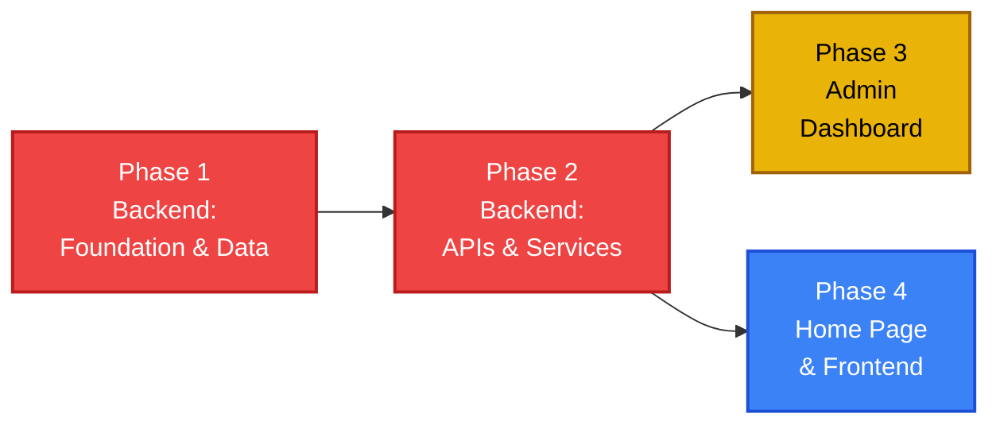

# Implementation Plan — Way2Car Car Rental Booking Platform

> Derived from [architecture.md](file:///Users/iamprince/Desktop/ay2car1/docs/architecture.md) and [context.md](file:///Users/iamprince/Desktop/ay2car1/docs/context.md)

---

## Current State

The project currently contains only the `docs/` directory with foundational documentation. No source code, database schemas, or configuration files exist yet. This plan covers the full build from zero to production, split into **4 phases**: two backend phases, an admin dashboard phase, and a premium home page / frontend phase.

---

## Phase 1 — Backend: Foundation & Data Layer 🔴 Critical

**Goal:** Bootstrap the project, establish the database with seeded data, define all types, and set up core utility libraries — so the data layer is solid before any API work begins.

---

### 1.1 Project Scaffolding

| Task | Details |
|------|---------|
| Initialize Next.js 14+ (App Router) | `npx -y create-next-app@latest ./ --typescript --app --eslint --src-dir --no-tailwind` |
| Configure TypeScript | Strict mode, path aliases (`@/` → `src/`) in `tsconfig.json` |
| Install backend dependencies | `prisma`, `@prisma/client`, `zod`, `next-auth`, `bcryptjs`, `razorpay`, `resend`, `@upstash/redis` |
| Create `.env.example` | Template for `DATABASE_URL`, `NEXTAUTH_SECRET`, `RAZORPAY_KEY_ID`, `RAZORPAY_KEY_SECRET`, `RESEND_API_KEY`, `UPSTASH_REDIS_REST_URL`, `UPSTASH_REDIS_REST_TOKEN` |
| Set up project structure | Create all directories per [architecture §4](file:///Users/iamprince/Desktop/ay2car1/docs/architecture.md) |

**Files created:**
- `package.json`, `tsconfig.json`, `next.config.js`, `.env.example`
- `src/app/layout.tsx` — Minimal root layout (placeholder, no design yet)
- `src/app/page.tsx` — Minimal placeholder page

---

### 1.2 Type Definitions

Create TypeScript interfaces in `src/types/`:

| File | Types |
|------|-------|
| `vehicle.ts` | `Vehicle`, `VehicleType` (enum: SEDAN, SUV, HATCHBACK, LUXURY, CONVERTIBLE, VAN), `VehicleFeatures` |
| `booking.ts` | `Booking`, `BookingStatus` (enum: PENDING, CONFIRMED, ACTIVE, COMPLETED, CANCELLED), `CreateBookingInput` |
| `user.ts` | `User`, `UserRole` (enum: CUSTOMER, ADMIN), `RegisterInput`, `LoginInput` |
| `location.ts` | `Location` |
| `payment.ts` | `Payment`, `PaymentStatus` (enum: PENDING, SUCCEEDED, FAILED, REFUNDED) |

---

### 1.3 Database Setup

| Task | Details |
|------|---------|
| `prisma/schema.prisma` | Define all 6 models per [architecture §5](file:///Users/iamprince/Desktop/ay2car1/docs/architecture.md): `User`, `Vehicle`, `Location`, `Booking`, `Payment`, `Availability` |
| Run initial migration | `npx prisma migrate dev --name init` |
| `prisma/seed.ts` | Seed script: 3 locations, 12+ vehicles with real specs/pricing, availability data for next 60 days, 1 admin user, 2 test customers |
| `src/lib/db.ts` | Prisma client singleton (avoid multiple instances in dev) |

**Schema highlights:**
- UUIDs for all primary keys (`@default(uuid())`)
- Enum types for `VehicleType`, `BookingStatus`, `PaymentStatus`, `UserRole`
- `isActive` flag on Vehicle and Location (soft deletes)
- `confirmationCode` on Booking (unique, human-readable: `W2C-XXXXX`)
- Proper indexes on `Vehicle.locationId`, `Booking.userId`, `Availability.vehicleId + date`

---

### 1.4 Core Utility Libraries

| File | Purpose |
|------|---------|
| `src/lib/db.ts` | Prisma client singleton |
| `src/lib/redis.ts` | Redis client (Upstash REST SDK) |
| `src/lib/razorpay.ts` | Razorpay SDK config with key + secret |
| `src/lib/email.ts` | Email service (Resend SDK) with HTML templates |
| `src/lib/auth.ts` | Auth helpers: `getServerSession()`, `requireAuth()`, `requireAdmin()` |
| `src/lib/validators.ts` | Zod schemas for all API inputs |
| `src/lib/utils.ts` | General helpers: date formatting, price calculation, confirmation code generator |

---

### Phase 1 Verification

- [ ] Next.js project runs locally with `npm run dev`
- [ ] Prisma schema compiles and migration runs cleanly
- [ ] Database seeded with 3 locations, 12+ vehicles, 60 days of availability, 3 users (1 admin + 2 customers)
- [ ] Prisma client singleton works in dev mode
- [ ] All Zod validators pass for valid input and reject invalid input
- [ ] Utility functions (price calculation, confirmation code generation) work correctly

---

## Phase 2 — Backend: APIs, Auth & Services 🔴 Critical

**Goal:** Build every API endpoint, authentication, payment processing, email, and caching — so the entire backend is fully functional and testable via Postman/Thunder Client before any frontend work begins.

---

### 2.1 Authentication (NextAuth.js)

| Task | Details |
|------|---------|
| `src/app/api/auth/[...nextauth]/route.ts` | NextAuth config: Credentials provider + Google OAuth |
| Auth options | JWT strategy, Prisma adapter, custom pages |
| Session callback | Include `userId` and `role` in session token |
| `POST /api/auth/register` | `src/app/api/auth/register/route.ts` — Create user (hash password with bcrypt), return session |
| Middleware | `src/middleware.ts` — Route protection for `/booking/*`, `/admin/*`, `/api/bookings/*`, `/api/admin/*` |

---

### 2.2 Vehicle API

| Endpoint | File | Details |
|----------|------|---------|
| `GET /api/vehicles` | `src/app/api/vehicles/route.ts` | List with query params: `location`, `pickupDate`, `dropoffDate`, `type`, `minPrice`, `maxPrice`, `seats`, `transmission`, `sort`, `page`, `limit` |
| `GET /api/vehicles/:id` | `src/app/api/vehicles/[id]/route.ts` | Full vehicle detail with location join |
| `GET /api/vehicles/:id/availability` | `src/app/api/vehicles/[id]/availability/route.ts` | Check availability for a date range |
| `POST /api/vehicles` | `src/app/api/vehicles/route.ts` | Create vehicle (admin-only) |
| `PUT /api/vehicles/:id` | `src/app/api/vehicles/[id]/route.ts` | Update vehicle (admin-only) |
| `DELETE /api/vehicles/:id` | `src/app/api/vehicles/[id]/route.ts` | Soft-delete vehicle (admin-only, sets `isActive = false`) |

**Validation:** All query/body params validated with Zod schemas in `src/lib/validators.ts`.

---

### 2.3 Booking API

| Endpoint | File | Details |
|----------|------|---------|
| `POST /api/bookings` | `src/app/api/bookings/route.ts` | Create booking: validate availability (DB transaction for race-condition guard), calculate pricing, generate confirmation code (`W2C-XXXXX`) |
| `GET /api/bookings` | `src/app/api/bookings/route.ts` | List user's bookings, or all bookings (admin) |
| `GET /api/bookings/:id` | `src/app/api/bookings/[id]/route.ts` | Get booking details (owner or admin) |
| `PUT /api/bookings/:id` | `src/app/api/bookings/[id]/route.ts` | Update status (confirm, cancel, complete) |

**Business Logic:**
- Double-check availability at booking time (race condition guard via Prisma `$transaction`)
- Calculate `totalPrice = pricePerDay × days + taxAmount`
- Generate human-readable confirmation code: `W2C-` + 5 alphanumeric chars
- Update `Availability` table to mark booked dates as unavailable

---

### 2.4 Payment Integration (Razorpay)

| Endpoint | File | Details |
|----------|------|---------|
| `POST /api/payments/order` | `src/app/api/payments/order/route.ts` | Create Razorpay order for booking amount |
| `POST /api/payments/verify` | `src/app/api/payments/verify/route.ts` | Verify payment signature (HMAC SHA256) |
| `POST /api/payments/webhook` | `src/app/api/payments/webhook/route.ts` | Handle async Razorpay events (payment.captured, payment.failed, refund.processed) |

**Payment Flow (server-side):**
1. Frontend sends booking summary → Backend creates Razorpay order → returns `order_id`
2. After Razorpay checkout → Frontend sends `razorpay_payment_id`, `razorpay_order_id`, `razorpay_signature`
3. Backend verifies HMAC signature → Creates `Payment` record → Updates `Booking.status` to `CONFIRMED`
4. Webhook handles async edge cases (missed client-side verifications, refunds)

---

### 2.5 Email Service

| Task | Details |
|------|---------|
| `src/lib/email.ts` | Email service (Resend SDK) |
| Booking confirmation template | HTML email: confirmation code, vehicle details, dates, pickup info, total paid |
| Booking cancellation template | Cancellation notice with refund info |

---

### 2.6 Redis Caching

| Task | Details |
|------|---------|
| `src/lib/redis.ts` | Redis client (Upstash REST SDK) |
| Cache availability | Cache `Availability` lookups for next 30 days; TTL = 5 min |
| Cache search results | Cache popular search queries; TTL = 2 min |
| Cache invalidation | Invalidate relevant keys on booking create/cancel |

---

### 2.7 Admin APIs

| Endpoint | Details |
|----------|---------|
| `GET /api/admin/stats` | KPI data: total bookings, revenue, active vehicles, new customers (this month) |
| `GET /api/admin/bookings` | All bookings with filters (status, date range, vehicle) |
| `PUT /api/admin/bookings/:id` | Update booking status (admin override) |
| `POST /api/admin/refund/:bookingId` | Trigger Razorpay refund for cancelled bookings |

---

### 2.8 Error Handling & Production Hardening

| Task | Details |
|------|---------|
| Global error handler | Consistent error response format: `{ error: string, code: string, details?: any }` |
| Rate limiting | Rate limit on auth endpoints (5 req/min) and booking endpoints (10 req/min) |
| Input sanitization | All inputs validated and sanitized via Zod |
| Logging | Structured logging for API errors and payment events |
| Environment validation | Validate all required env vars at startup |

---

### Phase 2 Verification

- [ ] All Vehicle API endpoints return correct responses (list, detail, availability, CRUD)
- [ ] Auth flow works: register → login → session → protected routes redirect unauthenticated users
- [ ] Booking flow works: check availability → create booking → payment order → verify payment → confirm
- [ ] Race condition test: two simultaneous bookings for the same vehicle/date — only one succeeds
- [ ] Email templates render correctly (test with Resend preview)
- [ ] Redis caching working: cache hit returns faster, cache invalidation on booking create/cancel
- [ ] Admin endpoints protected (non-admins get 403)
- [ ] Error responses are consistent across all endpoints
- [ ] Rate limiting blocks excessive requests

---

## Phase 3 — Admin Dashboard 🟡 High

**Goal:** Build a complete admin panel with KPI overview, vehicle management, and booking management — giving the business owner full operational control.

---

### 3.1 Admin Layout & Navigation

| File | Details |
|------|---------|
| `src/app/admin/layout.tsx` | Admin layout with collapsible sidebar + top bar. Dark theme. Protected by `requireAdmin()` middleware — non-admins redirected to home. |
| `src/components/layout/Sidebar.tsx` | Collapsible sidebar with smooth width animation. Nav items: Dashboard · Vehicles · Bookings · Locations. Each item: icon + label. Active route: accent left border + subtle background highlight. Collapse to icon-only mode on small screens. Dark glass background. |
| Top bar | Admin name + avatar (right-aligned). Logout button. Breadcrumb trail. |

---

### 3.2 Dashboard Overview (`src/app/admin/page.tsx`)

| Widget | Details |
|--------|---------|
| **KPI Cards** (4-grid) | Total Bookings, Revenue (₹), Active Vehicles, New Customers (this month). Each card: icon, metric (animated count-up), % change from last month (green/red arrow). Glass background with subtle gradient. |
| **Recent Bookings** | Table of last 10 bookings: Confirmation Code, Customer Name, Vehicle, Dates, Amount, Status Badge. Row click → booking detail. |
| **Revenue Chart** | 30-day bar/line chart (lightweight CSS-based or `chart.js`). X-axis: days, Y-axis: revenue. Hover tooltip with daily total. |
| **Fleet Status** | Donut/pie chart: Available vs Booked vs Maintenance. Legend with count per status. |

---

### 3.3 Vehicle Management (`src/app/admin/vehicles/page.tsx`)

| Feature | Details |
|---------|---------|
| Vehicle table | Sortable, searchable list. Columns: Image (thumbnail), Make/Model, Year, Type, Price/Day, Location, Status (Active/Inactive), Actions. Pagination. |
| Add vehicle | "Add Vehicle" button → modal form: make, model, year, type, transmission, fuel, seats, doors, pricePerDay, description, features, images (upload to Cloudinary), location dropdown. Zod validation. |
| Edit vehicle | Row action → pre-filled modal form with existing data. |
| Deactivate vehicle | Row action → confirmation dialog → soft delete (`isActive = false`). |
| Image upload | Drag-and-drop zone or file picker. Preview thumbnails before save. Upload to Cloudinary, store URLs in DB. |

---

### 3.4 Booking Management (`src/app/admin/bookings/page.tsx`)

| Feature | Details |
|---------|---------|
| Booking table | All bookings. Top filter bar: Status dropdown (All, Pending, Confirmed, Active, Completed, Cancelled), Date Range picker, Vehicle search. Columns: Confirmation Code, Customer, Vehicle, Pickup Date, Dropoff Date, Amount, Status Badge, Actions. Pagination. |
| View booking | Row click → slide-in detail panel (or modal): full booking info, customer details (name, email, phone), vehicle info, payment status, timeline of status changes. |
| Update status | Status dropdown in detail view. Options depend on current status (e.g., Pending → Confirmed/Cancelled, Confirmed → Active/Cancelled). Confirmation dialog before status change. |
| Refund | For cancelled bookings: "Issue Refund" button → hits `POST /api/admin/refund/:bookingId` → triggers Razorpay refund → updates Payment status to REFUNDED. |

---

### 3.5 Admin Design System

| Element | Details |
|---------|---------|
| Tables | Striped rows, sticky header, hover highlight, responsive horizontal scroll on mobile |
| Forms | Floating labels, inline validation, loading submit button |
| Cards | Glass-morphism KPI cards with icon, metric, trend arrow |
| Charts | Clean, minimal charts that match the dark admin theme |
| Modals | Slide-in panels for detail views, centered modals for forms and confirmations |
| Toasts | Success/error toasts for CRUD operations |

---

### Phase 3 Verification

- [ ] Admin dashboard loads with real KPI data from `GET /api/admin/stats`
- [ ] Revenue chart renders correctly with 30-day data
- [ ] Fleet status chart shows correct breakdown
- [ ] Vehicle table: search, sort, and pagination work
- [ ] Add/Edit vehicle form validates and saves correctly
- [ ] Deactivate vehicle sets `isActive = false` and hides from public fleet
- [ ] Booking table: filter by status, date range, and vehicle
- [ ] Booking detail panel shows complete info
- [ ] Status update works with correct state transitions
- [ ] Refund triggers Razorpay refund and updates payment record
- [ ] Non-admin users cannot access `/admin/*` routes
- [ ] Responsive on tablet and desktop (admin is not mobile-first, but usable)

---

## Phase 4 — Home Page & Frontend 🔴 Critical

**Goal:** Build a **premium, visually stunning** frontend that feels like a luxury automotive experience — not a generic booking form. Every page should wow the user with refined typography, cinematic hero sections, buttery-smooth animations, glassmorphism accents, and pixel-perfect attention to detail.

---

### 4.1 Design Philosophy

> The Way2Car frontend should feel like walking into a premium car showroom — sleek, modern, and aspirational. The design language combines **dark luxury aesthetics** with **warm accent tones**, creating a visual experience that elevates a car rental into something desirable.

**Design Pillars:**
- **Cinematic** — Full-bleed hero images, dramatic lighting, large bold typography
- **Fluid** — Smooth transitions, scroll-triggered animations, micro-interactions everywhere
- **Premium** — Glassmorphism cards, subtle gradients, refined spacing, no visual clutter
- **Trustworthy** — Clean layouts, consistent spacing, professional typography, clear CTAs

---

### 4.2 Design System (CSS)

| File | Details |
|------|---------|
| `src/styles/globals.css` | CSS reset, CSS custom properties (full token system), base typography, smooth scrolling |
| `src/styles/components.css` | Reusable component styles (buttons, cards, inputs, badges, modals, tooltips, toasts) |
| `src/styles/utilities.css` | Layout helpers, flex/grid utilities, responsive visibility, text utilities |
| `src/styles/animations.css` | Keyframe animations, transition utilities, scroll-triggered animation classes |

**Design Tokens:**
```css
:root {
  /* Color Palette — Dark Luxury */
  --color-primary:        hsl(220, 90%, 56%);
  --color-primary-light:  hsl(220, 90%, 68%);
  --color-primary-dark:   hsl(220, 90%, 44%);
  --color-accent:         hsl(38, 92%, 50%);
  --color-accent-light:   hsl(38, 92%, 62%);

  /* Surfaces */
  --color-bg-primary:     hsl(220, 25%, 6%);
  --color-bg-secondary:   hsl(220, 20%, 10%);
  --color-bg-card:        hsl(220, 20%, 12%);
  --color-bg-elevated:    hsl(220, 20%, 16%);
  --color-surface-glass:  hsl(220 25% 15% / 0.6);

  /* Text */
  --color-text-primary:   hsl(220, 15%, 95%);
  --color-text-secondary: hsl(220, 15%, 65%);
  --color-text-muted:     hsl(220, 15%, 45%);

  /* Borders */
  --color-border:         hsl(220, 20%, 20%);
  --color-border-light:   hsl(220, 20%, 25%);

  /* Status */
  --color-success:        hsl(142, 71%, 45%);
  --color-warning:        hsl(38, 92%, 50%);
  --color-error:          hsl(0, 84%, 60%);
  --color-info:           hsl(200, 90%, 55%);

  /* Typography Scale */
  --font-body:            'Inter', -apple-system, sans-serif;
  --font-display:         'Outfit', 'Inter', sans-serif;
  --text-xs:   0.75rem;
  --text-sm:   0.875rem;
  --text-base: 1rem;
  --text-lg:   1.125rem;
  --text-xl:   1.25rem;
  --text-2xl:  1.5rem;
  --text-3xl:  1.875rem;
  --text-4xl:  2.25rem;
  --text-5xl:  3rem;
  --text-6xl:  3.75rem;
  --text-7xl:  4.5rem;

  /* Spacing */
  --space-1: 0.25rem;  --space-2: 0.5rem;  --space-3: 0.75rem;
  --space-4: 1rem;     --space-5: 1.25rem;  --space-6: 1.5rem;
  --space-8: 2rem;     --space-10: 2.5rem;  --space-12: 3rem;
  --space-16: 4rem;    --space-20: 5rem;    --space-24: 6rem;

  /* Radii */
  --radius-sm: 0.375rem;  --radius-md: 0.75rem;
  --radius-lg: 1rem;      --radius-xl: 1.5rem;
  --radius-full: 9999px;

  /* Shadows */
  --shadow-sm:    0 1px 3px hsl(220 25% 0% / 0.3);
  --shadow-md:    0 4px 16px hsl(220 25% 0% / 0.3);
  --shadow-lg:    0 8px 32px hsl(220 25% 0% / 0.4);
  --shadow-xl:    0 16px 48px hsl(220 25% 0% / 0.5);
  --shadow-glow:  0 0 30px hsl(220 90% 56% / 0.15);

  /* Glass */
  --glass-bg:     hsl(220 25% 15% / 0.6);
  --glass-border: hsl(220 25% 30% / 0.3);
  --glass-blur:   12px;

  /* Transitions */
  --transition-fast:    150ms cubic-bezier(0.4, 0, 0.2, 1);
  --transition-base:    250ms cubic-bezier(0.4, 0, 0.2, 1);
  --transition-smooth:  400ms cubic-bezier(0.16, 1, 0.3, 1);
  --transition-spring:  500ms cubic-bezier(0.34, 1.56, 0.64, 1);
}
```

**Typography:** Load **Inter** (body) and **Outfit** (headings) via `next/font/google`.

---

### 4.3 UI Primitives — Component Library

Build in `src/components/ui/`:

| Component | Details |
|-----------|---------|
| `Button.tsx` | Variants: primary (gradient fill + glow), secondary (glass), ghost (transparent), danger. Sizes: sm, md, lg. Loading spinner, disabled state. Hover: scale + shadow. Ripple on click. |
| `Card.tsx` | Glass-morphism surface with subtle border. Hover: lift + border glow. Image slot with zoom-on-hover. Variants: default, elevated, interactive. |
| `Input.tsx` | Floating label pattern. Types: text, email, password (toggle visibility), select, date. Focus: glowing border. Error state: red border + shake animation. |
| `Modal.tsx` | Centered overlay with glass backdrop blur. Enter/exit: scale + fade. Focus trap, Escape to close. Sizes: sm, md, lg, full. |
| `Badge.tsx` | Pill-shaped. Variants: success, warning, error, info, neutral, premium (gold gradient). Pulse animation for "Available". |
| `Skeleton.tsx` | Shimmer animation loading placeholder. Variants: text, card, image, circle. |
| `Toast.tsx` | Slide-in notification. Variants: success, error, warning, info. Auto-dismiss with progress bar. |
| `Stepper.tsx` | Multi-step progress indicator. Animated progress. Active/completed/upcoming states. |
| `DatePicker.tsx` | Calendar date range selector. Dark themed. Disabled dates for unavailable days. |
| `Dropdown.tsx` | Animated dropdown menu. Glass background. Keyboard navigable. |
| `Avatar.tsx` | Circular image with fallback initials. Sizes: sm, md, lg. |

---

### 4.4 Layout Shell

| Component | Details |
|-----------|---------|
| `Header.tsx` | **Transparent on hero → solid on scroll** (backdrop blur transition). Logo, nav links with hover underline animation (Home · Fleet · Search), auth CTA with glow. Mobile: animated hamburger → fullscreen overlay menu with staggered link entrance. |
| `Footer.tsx` | Dark section. 4-column grid: Brand (logo + tagline + social), Quick Links, Services, Contact. Social icon hover effects. Bottom bar: copyright + legal. Responsive collapse on mobile. |

Wire into `src/app/layout.tsx`.

---

### 4.5 Home Page (`src/app/page.tsx`) ⭐ Flagship

The home page is the **showcase** — it must leave a lasting first impression.

| Section | Details |
|---------|---------|
| **Hero** | Full-viewport cinematic hero. Premium car image with dark gradient overlay. Bold headline (Outfit, 60–72px): "Drive Your Dream". Subheading with typing animation. Two CTAs: "Browse Fleet" (primary, glowing) + "How It Works" (ghost). Floating scroll-down indicator with bounce. Parallax on background. |
| **Quick Search Bar** | Floating glass-morphism card overlapping hero bottom edge. 3 fields: Location (dropdown), Date Range (calendar picker), Vehicle Type (select). "Search" button with gradient + arrow. Subtle glow on focus. Animate in on scroll. |
| **Featured Fleet** | Section heading with accent underline animation. Grid of 4 `VehicleCard` with staggered reveal-on-scroll. Cards: glass bg, image zoom-on-hover, vehicle name, type badge, rating, price/day. Carousel on mobile. |
| **How It Works** | 3-step flow with connecting animated line. Each step: numbered gradient circle, icon, title, description. Steps reveal sequentially on scroll with line drawing itself. |
| **Stats Counter** | Full-width dark section. 4 animated counting numbers on scroll: "500+ Happy Customers", "50+ Premium Vehicles", "3 Locations", "24/7 Support". Numbers count up from 0 with easing. |
| **Testimonials** | Carousel with glass cards. Customer photo (avatar), name, star rating, quote. Auto-rotating with dots. Pause on hover. Smooth crossfade. |
| **CTA Banner** | Full-width gradient section (primary → accent). Bold headline: "Ready to Hit the Road?". Large CTA button (white on dark) with hover lift. Background animated shapes. |

---

### 4.6 Fleet Browsing Pages

| File | Details |
|------|---------|
| `src/app/fleet/page.tsx` | **Fleet Listing.** Heading with animated accent bar. Filter pills (All · Sedan · SUV · Luxury · etc.) with active animation. Vehicle grid with animated entrance. Sort dropdown. Skeleton loading. Grid layout transitions on filter change. |
| `src/app/fleet/[vehicleId]/page.tsx` | **Vehicle Detail.** Full-width hero image gallery (main + thumbnails, fade transitions). Glass info card floating over hero: name, type, rating, price. Tab bar: Overview · Specs · Pricing · Reviews. Specs grid with icons. Pricing table (daily/weekly/monthly). Availability calendar (green/red dates). Sticky "Book Now" CTA bar. Breadcrumbs. |
| `src/components/fleet/VehicleCard.tsx` | Glass card. Hover: image zoom + card lift + border glow. Lazy loaded image with blur placeholder. Name, year, type badge, star rating, price. Quick-view on hover. |
| `src/components/fleet/VehicleGallery.tsx` | Main image with lightbox. Thumbnail strip. Smooth transitions. Touch-swipe on mobile. |
| `src/components/fleet/VehicleSpecs.tsx` | 2-column icon grid. Accent-colored icons. Animate on scroll. |
| `src/components/fleet/PricingTable.tsx` | Daily, 3-day, weekly, monthly rates. Insurance add-on. Highlighted total row. |
| `src/components/fleet/AvailabilityCalendar.tsx` | Monthly calendar. Green = available, red = booked. Accent highlight for selected range. Smooth month transitions. |

---

### 4.7 Search Page

| File | Details |
|------|---------|
| `src/app/search/page.tsx` | Search bar (top) + filter panel (left) + results grid (right). URL-based state for shareability. |
| `src/components/search/SearchBar.tsx` | Horizontal bar: Location, Date Range, Vehicle Type, "Search" CTA. Glass background. |
| `src/components/search/FilterPanel.tsx` | Collapsible sidebar. Price range (dual-handle slider), Seats, Transmission, Fuel Type. Clear All button. Filter count badge. Mobile: slide-in drawer. |
| `src/components/search/SearchResults.tsx` | Vehicle grid with animated transitions. "X vehicles found" count. Sort dropdown. Skeleton loading (4 cards). Empty state with illustration + suggestions. Pagination. |
| `src/hooks/useSearch.ts` | Manages search state, debounced API calls, pagination, URL sync. |
| `src/hooks/useAvailability.ts` | Checks vehicle availability for selected dates. |

---

### 4.8 Booking Flow Pages

| File | Details |
|------|---------|
| `src/app/booking/page.tsx` | **Multi-step wizard.** Stepper: Vehicle → Details → Review → Payment. Smooth slide transitions between steps. |
| `src/app/booking/confirmation/page.tsx` | **Success page.** Animated checkmark (draw-in). Large confirmation code (copy-to-clipboard). Booking details card. "What's Next" section. Buttons: "View My Bookings" + "Print Receipt". Confetti animation. |
| `src/components/booking/BookingForm.tsx` | Location dropdowns, date pickers. Animated transitions. Inline validation (shake on error). |
| `src/components/booking/BookingSummary.tsx` | Glass card: base rate × days, taxes, insurance, total. Vehicle mini-card at top. Accent-highlighted total. |
| `src/components/booking/PaymentForm.tsx` | Razorpay checkout button: "Pay ₹X,XXX" with glow. Security badges. Loading state. |
| `src/components/booking/ConfirmationCard.tsx` | Checkmark, confirmation code (monospace), booking details grid. |
| `src/hooks/useBooking.ts` | Multi-step state, pricing calculation, API submission, payment flow. |

---

### 4.9 Authentication UI

| File | Details |
|------|---------|
| `src/app/auth/login/page.tsx` | Split layout: left — branded car image + tagline; right — login form. Email + password (floating labels). Google OAuth button. "Forgot password?" and "Register" links. Animated error states. |
| `src/app/auth/register/page.tsx` | Same split layout. Fields: Name, Email, Phone, Password, Confirm Password. Password strength meter (animated: red → yellow → green). |
| Header auth integration | Logged in: avatar dropdown (slide-down) → "My Bookings", "Profile", "Logout". Admin: adds "Dashboard" link. |

---

### 4.10 User Booking History

| File | Details |
|------|---------|
| `src/app/bookings/page.tsx` | Tab bar: "Upcoming" · "Past" · "Cancelled". Booking cards: vehicle image, dates, status badge (pulse for "Active"), confirmation code, total. Expand → full details. Cancel button → confirmation modal → refund info. Animated tab transitions. |

---

### 4.11 Animations & Micro-Interactions

| Category | Details |
|----------|---------|
| **Page transitions** | Fade + subtle slide between routes. Staggered section fade-in on load. |
| **Scroll animations** | Reveal-on-scroll via Intersection Observer. Staggered children (50ms delay each). Parallax on hero images. Counter animations for stats. |
| **Hover effects** | Cards: translateY(-4px) + shadow lift + border glow. Buttons: scale(1.02) + shadow. Images: scale(1.05) with overflow hidden. Links: animated underline from left. |
| **Loading states** | Skeleton shimmer for all data content. Button spinners. Multi-step progress bar. |
| **Feedback** | Toast slide-in (top-right, auto-dismiss). Form error: shake + red pulse. Success: green checkmark draw. Copy: "Copied!" tooltip fade. |
| **Navigation** | Mobile menu: fullscreen overlay with staggered link reveal. Dropdown: scale + fade. |
| **`prefers-reduced-motion`** | Disable all animations when user prefers reduced motion. |

---

### 4.12 SEO

| Task | Details |
|------|---------|
| Meta tags | Dynamic `<title>` and `<meta description>` per page |
| Open Graph | OG image, title, description for social sharing |
| Structured data | JSON-LD for `AutoRental`, `Product` (vehicles), `LocalBusiness` |
| Sitemap | Auto-generated `sitemap.xml` via Next.js |
| Robots | `robots.txt` with crawl rules |

---

### 4.13 Performance & Accessibility

| Task | Details |
|------|---------|
| Image optimization | `next/image` with responsive sizes, lazy loading, blur placeholders |
| Code splitting | Dynamic imports for heavy components (calendar, charts, payment modal) |
| Core Web Vitals | Target LCP < 2.5s, FID < 100ms, CLS < 0.1 |
| Keyboard navigation | Full tab/enter/escape support |
| ARIA labels | Labels on all interactive elements |
| Color contrast | All text meets 4.5:1 contrast ratio |
| Focus indicators | Visible focus rings on all focusable elements |

---

### 4.14 Error Pages & Production Polish

| Task | Details |
|------|---------|
| `src/app/not-found.tsx` | Branded 404 page with illustration + "Back to Home" CTA |
| `src/app/error.tsx` | 500 error page with retry button |
| Error boundaries | Per-page error boundaries with graceful fallback UI |
| Vercel deployment | Connect repo, env vars, preview deployments |
| Domain & SSL | Custom domain, HTTPS via Vercel |

---

### Phase 4 Verification

- [ ] Home page renders all 7 sections with animations and real data
- [ ] Design system consistent across every page (tokens, spacing, typography)
- [ ] Every interactive element has hover, focus, active, and disabled states
- [ ] Animations smooth at 60fps; `prefers-reduced-motion` disables them
- [ ] Mobile responsive at 375px, 768px, 1024px, 1440px
- [ ] Core Web Vitals passing (LCP < 2.5s, CLS < 0.1)
- [ ] Full SEO: meta tags, structured data, sitemap
- [ ] WCAG 2.1 AA: keyboard nav, ARIA labels, contrast ratios
- [ ] End-to-end booking flow: search → select → book → pay → confirmation
- [ ] Auth flow: register → login → protected routes → user menu
- [ ] User booking history with cancellation
- [ ] Custom 404 and 500 error pages
- [ ] Production deployment on Vercel

---

## Phase Dependencies



> **Phase 1 → Phase 2:** APIs depend on the database and core libraries built in Phase 1.
> **Phase 2 → Phase 3 & 4:** Both the admin dashboard and the frontend consume the APIs built in Phase 2. **Phase 3 and Phase 4 can run in parallel** if resources allow.

---

## Summary

| Phase | Scope | Priority | Est. Effort |
|-------|-------|----------|-------------|
| **Phase 1** — Backend: Foundation | Project setup, types, database, Prisma schema, seed data, core libraries | 🔴 Critical | ~3–4 days |
| **Phase 2** — Backend: APIs & Services | Auth, Vehicle API, Booking API, Payments, Email, Redis, Admin APIs, error handling | 🔴 Critical | ~5–7 days |
| **Phase 3** — Admin Dashboard | Admin layout, KPI dashboard, vehicle CRUD, booking management, charts | 🟡 High | ~3–4 days |
| **Phase 4** — Home Page & Frontend | Design system, UI components, all pages (home, fleet, search, booking, auth), animations, SEO, accessibility | 🔴 Critical | ~8–12 days |
| **Total** | | | **~19–27 days** |
